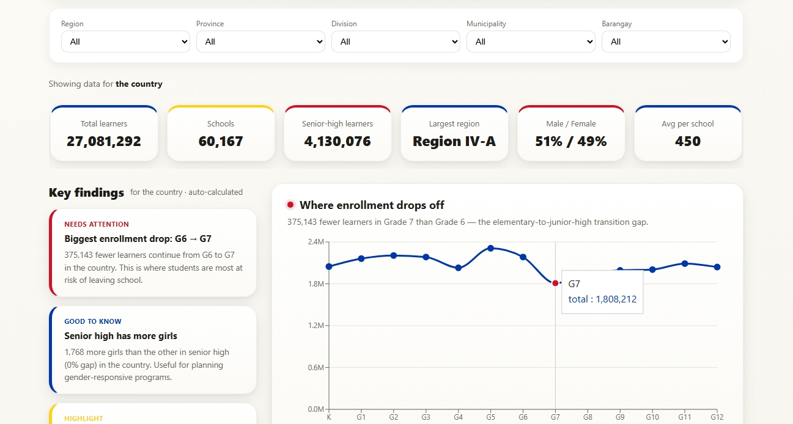

# Aralite

**In-browser SQL analytics for Philippine school enrollment — no server, no database bill.**

Aralite turns the Department of Education's raw enrollment file (60,000+ schools, 27M learners) into a clean, filterable dashboard. It runs a real SQL database *inside the browser*, so anyone can explore the data — drill from region down to a single barangay, read auto-generated findings, or even ask questions in plain English.

🔗 **Live demo:** [aralite.vercel.app](https://aralite.vercel.app)



## Why this exists

This started as a university case study in a Big Data course. The scenario: DepEd's Learner Information System collects enrollment data, but there's no dashboard on top of it — other offices have to request figures by hand, one at a time. The exercise was to design something planners could actually use.

I rebuilt it from scratch afterwards as an independent project, because the class version ran on a laptop and I wanted to learn what it takes to ship something a stranger can open.

## Features

- **One-look dashboard** — total learners, the Grade 6→7 drop-off, gender balance, senior-high strand choices (and by gender), public vs private split, what schools offer, and enrollment by region.
- **Location filters** — five cascading levels (Region → Province → Division → Municipality → Barangay) drive every chart and stat.
- **Key findings** — plain-language insights auto-calculated from the data, updating with the filter.
- **Ask the data** — type a question in plain English; your own AI key (Groq or Gemini) writes the SQL, which runs read-only in the browser. The SQL is shown for trust.
- **Admin page** — separate `/admin` area to upload, clean, publish, and remove datasets.
- **Clean any dataset** — upload CSV/Excel; it's cleaned in your browser (encoding, junk, invalid values, name/address standardization) and downloadable. Nothing leaves your computer.

## Data & method

**Source:** DepEd Learner Information System, school-level enrollment, SY 2023–2024. Public data, downloaded as an Excel file.

**Shape:** 60,171 rows — one per school — with 14 descriptive columns and 58 enrollment columns. Reshaped into roughly 3.5 million rows, one per school × grade × gender.

**The governing rule was zero data loss.** The cleaning script never deletes a row or a column. It repairs values in place and adds standardized copies alongside the originals, so every published number can be traced back to the source file.

What `pipeline/clean.py` does:

| Step | What and why |
|---|---|
| Find the real header | The file opens with four rows of title text, so the actual column names sit on row 5. |
| Repair mojibake | `Ñ` saved as UTF-8 but read as Latin-1 arrives as `Ñ`. The bad decode is reversed, not stripped — deleting would corrupt school names. |
| Strip leading junk | Stray `-`, `#`, `*`, `.` and quote marks from data entry break sorting and search. |
| Squeeze whitespace | Without this, `Bacarra  I` and `Bacarra I` group as two different divisions. |
| Standardize casing | Geographic columns arrive in all caps. Filters and joins are case-sensitive, so inconsistent casing splits real groups. School names keep their official casing. |
| Label invalid values | Placeholder entries are marked rather than silently dropped. |
| Add clean copies | Standardized school name and address are added as new columns beside the originals. |
| Reshape wide → long | 58 enrollment columns become rows, each parsed into grade, strand, and gender. |
| Export | Parquet files, plus a `quality_report.md` recording every repair count. |

**Why Parquet and DuckDB-WASM:** a 30MB Excel file becomes a few MB of compressed columnar data, and DuckDB runs real SQL over it inside the browser. No server means nothing to pay for or maintain, and when someone uploads their own file it never leaves their computer.

## Limits

Worth being direct about what this data cannot answer:

- **It's a one-time snapshot**, not a live feed. One school year, so no trends over time.
- **The grain is the school, not the learner.** Aralite can't follow individual students or explain why anyone left.
- **The Grade 6→7 gap is not a dropout rate.** It's the difference between two grade levels within a single year, which can reflect migration, cohort size, or reporting differences as much as anything else. It's a signal worth investigating, not a measurement.
- **Uploaded datasets live in browser memory only** and disappear on refresh, by design.

For the live-pipeline version of this idea — data that collects itself on a schedule, with validation and a run log — see [Presyo](https://github.com/angelinetipa/presyo), which is the sibling project to this one.

## Tech stack

**Frontend:** React, TypeScript, Vite, React Router, Recharts
**Data engine:** DuckDB-WASM (SQL in the browser), Parquet
**Cleaning pipeline:** Python, pandas
**AI (optional):** Groq / Gemini via bring-your-own-key
**Testing/CI:** Vitest, GitHub Actions
**Hosting:** Vercel

## Getting started

**Prerequisites**
- [Node.js](https://nodejs.org) (v18+)
- [Git](https://git-scm.com)

**1. Clone**
```bash
git clone https://github.com/angelinetipa/aralite.git
cd aralite
```

**2. Install**
```bash
npm install
```

**3. Run**
```bash
npm run dev
```
Open the printed link (usually `http://localhost:5173`). Data files ship with the repo — nothing else to set up.

**Optional — rebuild data from the raw DepEd file** (needs Python + pandas + pyarrow)
```bash
python pipeline/clean.py
```

## Testing

```bash
npm test        # run unit tests (Vitest)
npm run lint    # check code style
npm run build   # type-check + production build
```

## Project structure

```
aralite/
├── pipeline/clean.py         # Python cleaning pipeline (raw Excel → Parquet)
├── data/                     # raw + cleaned data
├── public/data/              # Parquet files served to the browser
├── src/
│   ├── App.tsx               # router (dashboard + admin)
│   ├── pages/                # DashboardPage, AdminPage
│   ├── components/           # charts, stat cards, filters, upload, ask
│   ├── lib/
│   │   ├── db.ts             # DuckDB setup + upload reshaping
│   │   ├── queries.ts        # all SQL queries
│   │   ├── insights.ts       # auto-calculated findings
│   │   ├── cleaning.ts       # browser cleaning rules (+ tests)
│   │   ├── ai.ts             # natural-language → SQL (BYOK)
│   │   └── filters.ts        # shared location-filter logic
│   └── constants/theme.ts    # colors + design tokens
└── .github/workflows/ci.yml  # lint + build + test on every push
```

## Notes

- Aralite is an independent self-learning project. It uses real public DepEd data but is not affiliated with the Department of Education, and no part of it has been adopted or reviewed by them.
- AI features are optional and use your own API key, which stays in your browser and is never stored.
- `docs/LEARNING.md` explains how every piece works in plain language.

---

Data: DepEd Learner Information System, SY 2023–2024.
Built by [Angeline Tipa](https://github.com/angelinetipa).