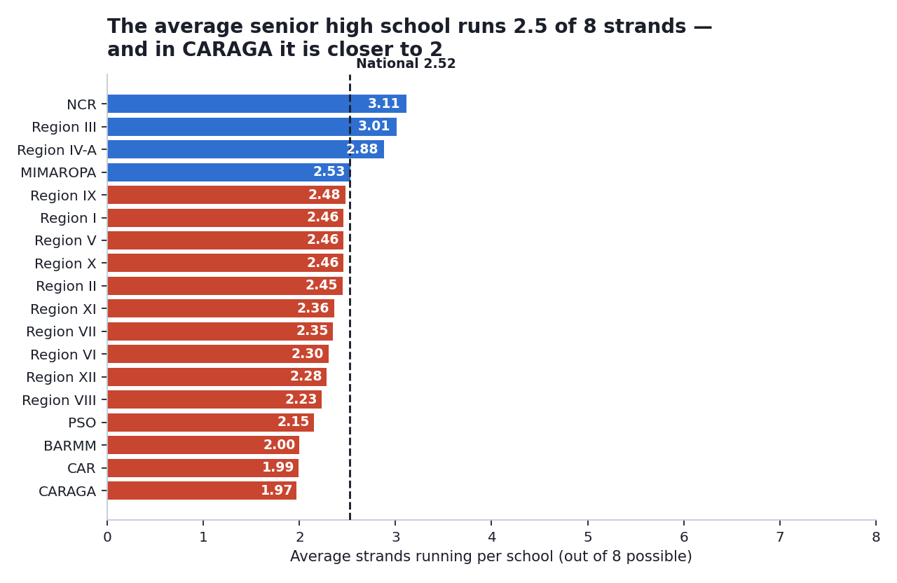
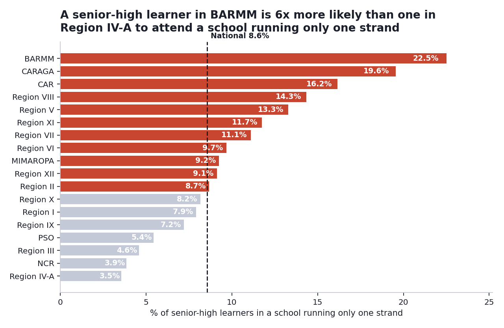
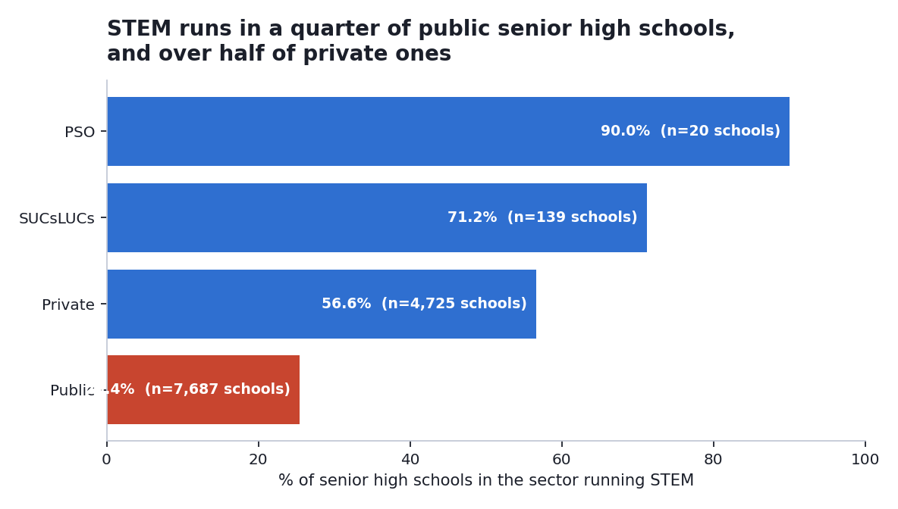

# A senior-high learner in BARMM is six times more likely than one in Region IV-A to attend a school running only one strand

## The question

Senior high school in the Philippines is built around choosing a track. But a learner can only enrol in a strand their own school actually runs. So when enrollment in a region bunches into two or three strands, that can mean learners wanted those strands — or it can mean nothing else was available. Those two explanations lead to completely different decisions, and this is the question of which one the data supports.

It matters to whoever decides where new strand offerings and specialist teachers go. If the pattern is preference, the answer is to fund what learners are picking. If it is availability, the answer is to widen what is on offer, and to do it in specific places.

## The data

| | |
|---|---|
| **Source** | DepEd Learner Information System, school-level enrollment |
| **Coverage** | School year 2023–2024, as of 31 January 2024 |
| **One row is** | One school (60,167 of them) |
| **Slice used** | Grades 11–12 with enrollment above zero — 12,571 schools, 4,130,076 learners |
| **Working** | [`notebook.ipynb`](notebook.ipynb) · [`analysis.py`](analysis.py) · cleaning in [`../../pipeline/clean.py`](../../pipeline/clean.py) |

## Method

I counted how many distinct senior-high strands each school runs, then aggregated by region and by sector. To compare regions fairly I used shares and averages rather than raw counts, because a large region will always have a bigger raw number without that meaning anything. Every regional and strand total was reconciled back to the national figure before I looked at any result, and I recomputed CARAGA a second way by hand to confirm the table.

**One assumption carries this whole analysis.** The raw file has no "strands offered" column. `Modified COC` records which *levels* a school runs, not which *strands*. So availability is inferred from enrollment: a school counts as running a strand if at least one learner is enrolled in it. I measured how big that assumption is rather than leaving it implicit — see the first limit below.

## Findings

### 1. The average senior high school runs 2.5 of 8 possible strands

Nationally the figure is 2.52. It ranges from 1.97 in CARAGA to 3.11 in NCR. So "choosing a track" describes something quite different depending on where a learner lives — in the regions at the bottom of this list, the average school is running two strands, and a learner picks between them or leaves.

### 2. But single-strand schools are small, so the national picture is milder than it first looks

3,588 schools — 28.5% of all senior high schools — run only one strand. That number alone would suggest a widespread problem. It is not: those schools hold only **8.6%** of senior-high learners, because they average 98 learners each against 420 in schools running more than one strand.

Where it does bite is regionally. In BARMM 22.5% of senior-high learners attend a single-strand school, in CARAGA 19.6%, in CAR 16.2% — against 3.5% in Region IV-A and 3.9% in NCR. That is roughly a six-fold difference between the top and bottom of the list, and it is the sharpest result here.

### 3. STEM availability tracks sector, not just geography

STEM runs in 25.4% of public senior high schools and 56.6% of private ones. It needs laboratories and specialist teachers, so it is the strand most likely to follow school resources. Nationally STEM holds 18.3% of senior-high enrollment while running in only 37.8% of schools — the schools that do run it are larger, averaging 159 STEM learners each.

## What this cannot tell you

- **Availability is inferred, not stated.** No offerings column exists in the source file. A strand offered on paper with no enrollees is indistinguishable here from one not offered at all. 222 schools DepEd classifies as senior-high-offering report zero senior-high enrollment and are excluded — 1.7% of senior high schools, small enough not to move the regional picture, but every availability figure above is a slight undercount.
- **This does not separate preference from availability.** It shows the two are entangled and that the entanglement is much tighter in some regions than others. Settling it would need data this file does not contain: what learners applied for against what they enrolled in.
- **One school year, one snapshot.** No trend over time, and no way to tell whether a region is improving or getting worse.
- **The grain is the school, not the learner.** Nothing here follows an individual student or explains why anyone enrolled where they did.
- **Region means where the school is, not where the learner lives.** A learner who travels across a regional boundary to reach a school with more strands appears in this data as though that choice existed locally.

## So what

If DepEd can only widen strand offerings in four regions, the four are **BARMM, CARAGA, CAR, and Region VIII**. They sit at the bottom on both measures — fewest strands per school, and the largest share of learners in a school running only one — and the two rankings agreeing makes the choice less arbitrary than picking on either alone. PSO ranks low too, but at 20 schools it is too small to read as a pattern.

Which strands to add is not a question this data can answer, and I would not guess at it. Enrollment records what learners took, not what they wanted, so using it to choose new offerings would only repeat whatever was already available. That decision needs something this file does not contain: a survey of what learners in these regions would actually apply for, weighed against which strands lead to work locally. Adding strands nobody applies to spends the budget without widening anyone's options.

Before acting on any of this I would check whether learners cross regional boundaries for senior high. This data records where a school is, not where a learner lives. If learners in these regions routinely travel to a neighbouring one, the availability gap is still real but the access gap is smaller than it looks here — and the money would be going to the wrong place.

One thing this analysis does not say: that learners in these regions are worse off. It measures how many strands their schools run, and nothing else. A region with fewer strands available is not a region with less capable learners.

---

Part of [Aralite](../../README.md). Data is public and from DepEd; this analysis is independent and has not been reviewed or adopted by the Department of Education.